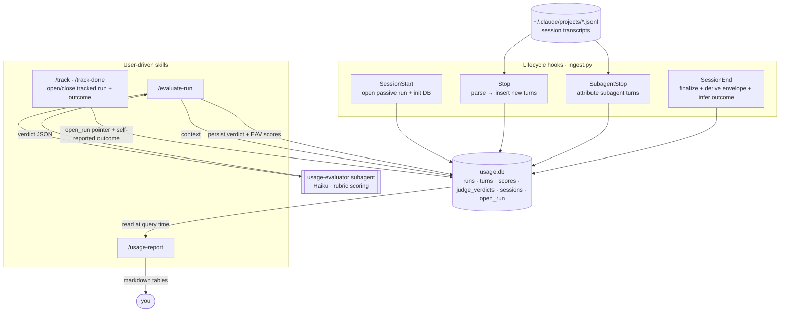

# claude-performance-tracker

A Claude Code plugin to **qualify good agent usage** and **compare approaches** on a
*cost-per-successful-outcome* basis. Cost is measured in **tokens + time + prompts** — never
dollars. The goal is not accounting and not forensics; it is to turn two fuzzy questions into
measured, repeatable answers:

1. *Am I using agents well?* — and is the model drifting over time?
2. *Which approach is better for this kind of task?* — which model, permission mode,
   subagent strategy, or skill gets a task done for the least token/time/prompt cost.

Everything is reconstructed from the session transcripts Claude Code already writes to
`~/.claude/projects/`. No external services, no daemon, no runtime dependencies.

---

## Table of contents

- [Core concepts](#core-concepts)
- [How it works (in detail)](#how-it-works-in-detail)
- [Data flow](#data-flow)
- [The data model](#the-data-model)
- [Commands](#commands)
- [Why a plugin (and not the alternatives)](#why-a-plugin-and-not-the-alternatives)
- [Development](#development)
- [Design notes & decisions](#design-notes--decisions)
- [Deferred / roadmap](#deferred--roadmap)

---

## Core concepts

**Run** — the unit of analysis. A bounded stretch of work with one cost envelope, one
approach, and one outcome. `run_id` is **session-independent** (a run can, in principle,
own turns from several sessions).

- **Passive run** — opened automatically per session; outcome is *inferred*. Zero effort,
  always on. Answers "where do I stand / is the model drifting."
- **Tracked run** — bracketed deliberately with `/track` … `/track-done`; outcome is
  *self-reported*. The instrument for controlled "approach A vs B" comparisons.

**Turn** — one user prompt and the assistant work that answered it. The atomic capture unit;
runs aggregate their turns.

**The three scoring layers**
1. **Deterministic metrics** (always on) — tokens, time, prompts, tool calls, output LOC,
   friction signals, context-window pressure.
2. **Self-reported outcome** (mandatory on tracked runs) — `success`/`partial`/`failed`
   plus a 1–5 satisfaction. The ground truth that makes cost interpretable.
3. **LLM judge** (opt-in / batched) — the `usage-evaluator` subagent scores an
   agent-behaviour rubric and per-prompt quality.

**Comparison** — approaches are ranked **within `{task_type × size}` buckets** on median
cost per *successful* run, with a small-sample guard that refuses to crown false winners.
Cheap-but-failed is never rewarded.

---

## How it works (in detail)

### Capture spine (hybrid, file-leaning)

The quantitative spine is **transcript parsing** today; every stored row carries a `source`
column (`transcript`). A future OpenTelemetry receiver writes the *same* tables with
`source='otel'`, so that upgrade is additive — not a migration.

### Hooks — the capture lifecycle

| Hook | Role |
|------|------|
| `SessionStart` | Initialise the DB (idempotent) and open the session's passive run. |
| `UserPromptSubmit` | Reserved for boundary markers (lightweight; capture happens at Stop). |
| `Stop` | **Workhorse.** Parse the transcript and insert this session's not-yet-seen turns. |
| `SubagentStop` | Parse the finished subagent's transcript; attach its turns to the parent run. |
| `SessionEnd` | Finalise the passive run: aggregate turns, derive the envelope, infer outcome. |

Hooks **never block the session**: any error exits 0 silently. They reach the same SQLite
file the skills use via `${CLAUDE_PLUGIN_DATA}`.

### Turn parsing (`transcript.py`)

- A **turn boundary** is a *real* user prompt — a `type=user` line that is **not** `isMeta`
  and **not** a tool result. Meta lines and tool results never start a turn.
- Assistant lines **duplicate** in the transcript (the same `message.id` appears several
  times), so token usage is summed **once per distinct `message.id`**.
- A turn is keyed on the user prompt's `uuid` (there is no per-turn id in the transcript).
- `include_sidechain=True` is used only when parsing a **subagent's own** transcript (which
  is entirely sidechain); a main transcript skips sidechain lines so embedded subagent lines
  are never double-counted.

### Capture is insert-only

A turn's run attribution is fixed when it is **first** seen — based on whichever run was
active at that `Stop`. Turns are never rewritten, so flipping the tracked/passive pointer
mid-session never re-labels earlier turns. Idempotent because `turn_id` is the primary key.

### Tracked runs & the `open_run` pointer

`/track` creates a `tracked` run and points the global, session-independent `open_run`
marker at it. The `Stop` hook gives that pointer **precedence** over the session's passive
run, so turns produced while tracking attach to the tracked run. `/track-done` finalises the
tracked run with its self-reported outcome and clears the pointer. A tracked run is **never**
force-closed by `SessionEnd` — only by `/track-done`. (This is why the skills need no
`session_id`: the pointer is global and the hook does attribution.)

### The deterministic envelope (`signals.py`)

At finalisation, signals are derived per turn and aggregated over a run's turns (scoped, so a
passive and a tracked run that share a session get **distinct** envelopes):

| Group | Fields / definition |
|-------|---------------------|
| Approach | `models`, `permission_mode` (distinct, mixed-mode aware), `subagents_used`, `skills_used`, `mcp_tools_used` (servers) |
| Output | `lines_added`/`removed` (from `toolUseResult.structuredPatch`), `files_touched`, `doc_words` (`.md`/doc edits) |
| Friction | `interrupts` (`toolUseResult.interrupted`), `re_prompts` (correction-cue prompts), `edits_without_read` (Edit on an un-read file — a Write *creates* context), `reasoning_loops` (a file read 3×+), `premature_stops` (`stop_reason=max_tokens`) |
| Context | `peak_context_pct` (max input+cache tokens / inferred window tier — 1M if any response >200k else 200k), `compact_count`, `clear_count` |

LOC comes **solely** from `structuredPatch` (Read results also carry a filePath but no patch,
so they never count as output). `effort` is left null — it isn't in the transcript and
arrives with the OTEL upgrade.

### Inferred outcome (`infer_outcome.py`)

Passive runs get a coarse outcome from deterministic signals (prompt positive/negative cues,
interrupts, re-prompts, whether output was produced) via a documented 6-step decision, stored
with `outcome_source='inferred'` and the signals as JSON in `inferred_signals` (auditable).
`unknown` is the honest fallback. Inferred labels are **never blended** with self-reported
ones in the comparison ranking — the compare view filters to `self_report` only.

### Qualitative scoring (`evaluate.py` + `usage-evaluator`)

`/evaluate-run` resolves targets (a run id, or recent un-judged runs), gathers `context`
(transcripts + per-turn prompts + the rubric), dispatches the **`usage-evaluator` subagent**
(Haiku, low effort) which returns a structured verdict, then `persist`s it: one
`judge_verdicts` row plus long-form `scores` rows. Scores are **EAV**
(`subject_type` `run`|`prompt`, `dimension`, `score`, `rationale`, `rubric_version`), so
adding a dimension to `rubric.yaml` requires **no schema change**. The rubric version is
parsed without a YAML dependency.

### Reporting (`report.py`)

All numbers are computed **at read time** from the raw `runs`/`turns`/`scores` tables —
nothing is pre-aggregated — so any future report shape or exporter is just a new query.

- `overview` — totals + by-model + by-project + by-day (+ by-query-source when subagents ran).
- `compare` — bucketed `{task_type × size}` cost-per-success ranking + small-sample guard.
- `degradation` — per-`{model × period}` trend of efficiency/friction + avg judge score.
- `run <id>` — the full scorecard for one run, including the judge verdict and per-prompt
  quality (joined through `scores`).

---

## Data flow



The `cpt` launcher (on `PATH`) is the skills' entry point: `cpt track …`, `cpt report …`,
`cpt eval …`.

---

## The data model

One SQLite database at `${CLAUDE_PLUGIN_DATA}/usage.db` (i.e.
`~/.claude/plugins/data/claude-performance-tracker/usage.db`):

| Table | Purpose |
|-------|---------|
| `runs` | One row per run = the scorecard (tags, approach, envelope, output, friction, context, outcome). |
| `turns` | One row per turn; carries `session_id` **and** `run_id` (so a run can span sessions) and `query_source` (`main`/`subagent`). |
| `scores` | Long-form (EAV) qualitative scores for runs and prompts, stamped with `rubric_version`. |
| `judge_verdicts` | One row per judge pass (provenance for the scores). |
| `sessions` | Maps `session_id → run_id` + the transcript path (keeps `run_id` session-independent). |
| `open_run` | Singleton pointer to the currently-open tracked run. |

Raw facts only — derived/comparison metrics are computed in `report.py`.

---

## Commands

| Skill | What it does |
|-------|--------------|
| `/track` | Open a tracked run (label, type, size, intended approach). |
| `/track-done` | Close it with a self-reported outcome + satisfaction. |
| `/usage-report` | Render `overview` / `compare` / `degradation` / `run <id>`. |
| `/evaluate-run` | Score run(s) with the `usage-evaluator` subagent. |

Under the hood (also usable directly):

```bash
cpt track start --label "…" --type feature --size M --approach "plan-mode, opus-4-8"
cpt track done  --outcome success --satisfaction 4
cpt report                       # overview
cpt report compare --by model    # or --by mode|subagent|skill|effort, --min N
cpt report degradation --period month
cpt report run <run_id>
cpt eval list-unjudged
```

---

## Why a plugin (and not the alternatives)

The capability is **inherently multi-component**: it needs *hooks* (capture), *skills*
(track/report/evaluate), a *subagent* (the judge), shared *scripts*, and shared *storage*.
The plugin is what lets those parts behave as one thing.

**vs. raw skills + hooks + a subagent wired up separately**
- They must be **versioned and installed together** — a hook that calls a script owned by a
  separate skill folder is fragile and breaks the moment one half moves. The plugin gives
  hooks a stable `${CLAUDE_PLUGIN_ROOT}` to find scripts.
- **Shared state needs a shared home.** Every component reads/writes one SQLite file; the
  plugin's `${CLAUDE_PLUGIN_DATA}` is a persistent dir that survives updates and is cleaned
  up on uninstall. Loose components have no agreed, stable data path.
- **One install / one uninstall / one version.** Manually merging hook config into
  `settings.json`, copying a subagent, and symlinking skills is error-prone and leaves
  orphans behind. `claude plugin install/uninstall` is atomic.
- **Auto-namespacing** (`/claude-performance-tracker:track`) avoids collisions with your
  other skills.
- **Distributable** via a marketplace, individually installable; future atomic pieces slot
  in alongside it.

**vs. OpenTelemetry + Prometheus/Grafana**
- Great for *metrics*, but it requires a **running collector/daemon** and it has no notion of
  *task identity*, *outcome*, or a *"good usage" rubric* — the things that make this useful.
  OTEL is on the roadmap as a precision **upgrade to the spine**, not a replacement for the
  annotation/evaluation layer.

**vs. a standalone script / cron job parsing JSONL**
- It can do accounting, but it can't hook the **lifecycle** — no `/track` demarcation, no
  live subagent attribution, no in-session skills. You'd be rebuilding half the plugin
  surface with none of the integration.

**vs. a hosted/cloud service**
- Your transcripts never leave the machine; no latency, no per-call cost, no account. For a
  personal "how do I use agents" tool, local-first is the right default.

---

## Development

Zero runtime dependencies (Python stdlib only — even the rubric is parsed without `pyyaml`),
so everything runs with just `python3`.

### Run the tests

```bash
cd plugins/claude-performance-tracker
python3 -m unittest discover -s tests          # 55 tests, dependency-free
```

### Iterate without reinstalling (fastest loop)

Load the plugin straight from the working tree for one session — picks up edits each launch:

```bash
claude --plugin-dir ~/Coding/claude-toolbox/plugins/claude-performance-tracker
```

### Refresh the installed copy

The marketplace caches a **snapshot** at the plugin's `version`, so `claude plugin update`
is a no-op while the version is unchanged. For same-version dev edits, reinstall:

```bash
claude plugin uninstall claude-performance-tracker@claude-toolbox
claude plugin marketplace update claude-toolbox
claude plugin install claude-performance-tracker@claude-toolbox
```

(Or bump `version` in both `plugin.json` and the marketplace entry, then `marketplace update`
+ `plugin update`.) Note: `cpt` only lands on `PATH` on a **new** session after install — the
skills include a cache-glob fallback for when it isn't found.

### Layout

```
claude-performance-tracker/
├── .claude-plugin/plugin.json
├── hooks/hooks.json                 # SessionStart · UserPromptSubmit · Stop · SubagentStop · SessionEnd
├── bin/cpt                          # PATH launcher/multiplexer: track | report | eval
├── agents/usage-evaluator.md        # Haiku judge (agent-behaviour + prompt quality)
├── skills/{track,track-done,usage-report,evaluate-run}/SKILL.md
├── scripts/
│   ├── db.py            # data-dir resolution + idempotent schema init
│   ├── schema.sql       # runs · turns · scores · judge_verdicts · sessions · open_run
│   ├── ingest.py        # hook dispatch (never blocks the session)
│   ├── transcript.py    # turn parsing (dedup, boundaries, sidechain)
│   ├── store.py         # run/turn persistence, tracked-run lifecycle, finalize
│   ├── signals.py       # deterministic envelope derivation
│   ├── infer_outcome.py # passive-run outcome heuristic
│   ├── evaluate.py      # list-unjudged · context · persist
│   ├── rubric.py        # rubric version/keys (no YAML dep)
│   ├── rubric.yaml      # the editable rubric (versioned)
│   └── report.py        # overview · compare · degradation · run
└── tests/               # one test module per slice, stdlib unittest
```

### Extending it

- **Add a rubric dimension** — add an entry under `agent_behavior` or `prompt_quality` in
  `rubric.yaml` and bump `version`. No schema change (scores are EAV); old scores keep their
  stamped version so reports never compare across rubric versions silently.
- **Add a deterministic metric** — derive it in `signals.py`; add a column to `runs` if it's
  run-level. Reports read raw rows, so surfacing it is a query change only.
- **Upgrade the spine to OTEL** — add an OTLP→SQLite writer that inserts rows with
  `source='otel'`; the schema and reports are already source-agnostic.

---

## Design notes & decisions

- **Marketplace source form** — use an explicit `source: "./plugins/<name>"` in
  `marketplace.json`. The `metadata.pluginRoot` + bare-name shorthand is rejected by some
  Claude Code versions ("source type your Claude Code version does not support").
- **`${CLAUDE_PLUGIN_ROOT}` is a *versioned* cache dir**
  (`…/cache/<marketplace>/<plugin>/<version>/`); bundled `scripts/` and `bin/` ship there.
- **`CLAUDE_PLUGIN_*` is not in the session shell**, so skills can't reference those vars in
  the commands they run — hence the `bin/cpt` launcher (plugin `bin/` *is* added to `PATH`)
  and the canonical default data dir.
- **Cost is tokens, not USD** — on a subscription there is no per-token bill; token counts
  are the consistent, comparable cost signal.
- **Comparison is bucketed and guarded** — averaging across task difficulty would just
  measure which approach you used on harder tasks; bucketing + a small-sample guard keeps it
  honest.

---

## Deferred / roadmap

Foundations are laid for each; none requires a rewrite:

- **OTEL receiver** — precise `cost_usd`/`duration_ms`/attribution without re-deriving.
- **Cross-session tracked runs** — resume an open tracked run in a later session
  (`run_id` is already session-independent; `open_run` already persists).
- **Scheduled digest**, **live statusline**, **real-time prompt coaching**, and richer
  **exporters** (JSON/CSV/HTML/dashboard) over the same raw tables.
