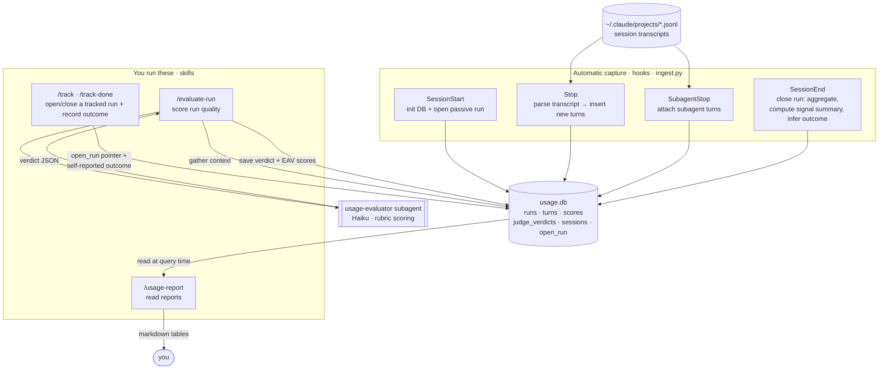

# claude-performance-tracker

A Claude Code plugin to **qualify good agent usage** and **compare approaches** on a
*cost-per-successful-outcome* basis. Cost is measured in **tokens + time + prompts**. The goal is to capture and prepare usage information in a way that the following 2 questions can be answered:

1. *Am I using agents well?* — and is the model drifting over time?
2. *Which approach is better for this kind of task?* — which model, permission mode,
   subagent strategy, or skill gets a task done for the least token/time/prompt cost.

Everything is reconstructed from the session transcripts Claude Code already writes to
`~/.claude/projects/`. No external services, no daemon and no runtime dependencies.

---

## Table of contents

- [TL;DR — how to use it](#tldr--how-to-use-it)
- [Core concepts](#core-concepts)
- [How it works (in detail)](#how-it-works-in-detail)
- [Data flow](#data-flow)
- [The data model](#the-data-model)
- [Commands](#commands)
- [Why a plugin (and not the alternatives)](#why-a-plugin-and-not-the-alternatives)
- [Development](#development)
- [Design notes & decisions](#design-notes--decisions)
- [Deferred / roadmap](#deferred--roadmap)

---

## TL;DR — how to use it

Install the plugin and it starts working right away. Then pick the flow that matches what you
want to do:

**Flow 1 — See how you're doing (nothing to set up)**

Just work normally. Every session is recorded automatically as a passive run. When you want a
summary:

```
/usage-report          # pick "overview"
```

**Flow 2 — Compare two approaches (A vs B)**

Bracket each attempt so its cost is measured on its own:

```
/track                 # name the task, its type and size, and the approach (e.g. "plan-mode, opus")
…do the work…
/track-done            # report the outcome: success / partial / failed + a 1–5 score
```

Repeat for the other approach, then compare:

```
/usage-report          # pick "compare" to rank approaches by cost per success
```

**Flow 3 — Get a quality score for a run**

Have the LLM judge score recent runs against the rubric:

```
/evaluate-run
```

**Flow 4 — Check whether the model is drifting over time**

```
/usage-report          # pick "degradation" for the per-model trend
```

See [Commands](#commands) for the full list and the equivalent `cpt` CLI calls.

---

## Core concepts

**Run**

The unit of analysis. A bounded stretch of work with one cost summary, one
approach, and one outcome. `run_id` is **session-independent** (a run can, in principle,
own turns from several sessions).

- **Passive run** — opened automatically per session; outcome is *inferred*. Zero effort,
  always on. Answers "where do I stand / is the model drifting."
- **Tracked run** — bracketed deliberately with `/track` … `/track-done`; outcome is
  *self-reported*. The instrument for controlled "approach A vs B" comparisons.

**Turn**

One user prompt and the assistant work that answered it. The atomic capture unit;
runs aggregate their turns.

**The three scoring layers**
1. **Deterministic metrics** (always on) — tokens, time, prompts, tool calls, output LOC,
   friction signals, context-window pressure.
2. **Self-reported outcome** (mandatory on tracked runs) — `success`/`partial`/`failed`
   plus a 1–5 satisfaction. The ground truth that makes cost interpretable.
3. **LLM judge** (opt-in / batched) — the `usage-evaluator` subagent scores an
   agent-behaviour rubric and per-prompt quality.

**Comparison** 

Approaches are ranked **within `{task_type × size}` buckets** on median
cost per *successful* run, with a small-sample guard that refuses to crown false winners.
Cheap-but-failed is never rewarded.

---

## How it works

### Where the data comes from

Today the numbers come from parsing session transcripts. Every stored row records its
`source` (`transcript`). A later OpenTelemetry receiver would write the *same* tables with
`source='otel'`, so adding it only adds rows — it doesn't require a migration.

### Hooks — how data is captured

| Hook | Role |
|------|------|
| `SessionStart` | Set up the DB if needed (safe to run repeatedly) and open the session's passive run. |
| `UserPromptSubmit` | Reserved for boundary markers (kept light; the actual capture runs at Stop). |
| `Stop` | Does the main work: parse the transcript and insert this session's new turns. |
| `SubagentStop` | Parse the finished subagent's transcript and attach its turns to the parent run. |
| `SessionEnd` | Close the passive run: aggregate turns, compute the signal summary, infer the outcome. |

Hooks never block the session: on any error they exit 0 and do nothing. They run via the
bundled `bin/cpt` launcher — a bash wrapper that picks a pyenv-independent interpreter (see
[Python resolution](#python-resolution)) — and read and write the same SQLite file the
skills use, found via `${CLAUDE_PLUGIN_DATA}`.

#### Python resolution

Hooks and the `cpt` launcher force pyenv's `system` interpreter (`PYENV_VERSION=system`).
Without this, a project that pins an **uninstalled** version via a pyenv `.python-version`
makes a bare `python3` (the pyenv shim) fail — e.g.
`pyenv: version '3.10.15' is not installed` — *before* our code runs, so the hook's own
error handling never gets a chance and the session shows a non-blocking hook error. The
plugin's scripts are stdlib-only and run on any Python 3.9+, so the system interpreter is
always sufficient. If you need a specific interpreter, set `CPT_PYTHON=/path/to/python3`.
The setting is harmless when pyenv is not installed.

### Turn parsing (`transcript.py`)

- A **turn** starts at a real user prompt: a `type=user` line that is not `isMeta` and not a
  tool result. Meta lines and tool results never start a turn.
- Assistant lines appear more than once in the transcript (the same `message.id` repeats), so
  token usage is counted **once per distinct `message.id`**.
- Each turn is keyed on the user prompt's `uuid`, since the transcript has no per-turn id.
- `include_sidechain=True` is set only when parsing a **subagent's own** transcript, which is
  entirely sidechain. A main transcript skips sidechain lines, so subagent lines embedded in
  it are never counted twice.

### Capture only ever inserts

A turn is assigned to a run the first time it's seen, based on whichever run was active at
that `Stop`. Turns are never rewritten, so switching the tracked/passive pointer mid-session
never re-labels earlier turns. It's safe to run repeatedly because `turn_id` is the primary
key.

### Tracked runs & the `open_run` pointer

`/track` creates a `tracked` run and points the global, session-independent `open_run` marker
at it. The `Stop` hook prefers that pointer over the session's passive run, so turns produced
while tracking attach to the tracked run. `/track-done` closes the tracked run with the
outcome you report and clears the pointer. `SessionEnd` never force-closes a tracked run —
only `/track-done` does. (This is why the skills need no `session_id`: the pointer is global,
and the hook decides attribution.)

### The signal summary (`signals.py`)

When a run closes, signals are derived per turn and aggregated over the run's turns. This is
scoped per run, so a passive and a tracked run that share a session get separate summaries:

| Group | Fields / definition |
|-------|---------------------|
| Approach | `models`, `permission_mode` (distinct, mixed-mode aware), `subagents_used`, `skills_used`, `mcp_tools_used` (servers) |
| Output | `lines_added`/`removed` (from `toolUseResult.structuredPatch`), `files_touched`, `doc_words` (`.md`/doc edits) |
| Friction | `interrupts` (`toolUseResult.interrupted`), `re_prompts` (correction-cue prompts), `edits_without_read` (Edit on an un-read file — a Write *creates* context), `reasoning_loops` (a file read 3×+), `premature_stops` (`stop_reason=max_tokens`) |
| Context | `peak_context_pct` (max input+cache tokens / inferred window tier — 1M if any response >200k else 200k), `compact_count`, `clear_count` |

Lines of code come only from `structuredPatch` (Read results carry a filePath but no patch,
so they never count as output). `effort` is left null — it isn't in the transcript and will
arrive with the OTEL upgrade.

### Inferred outcome (`infer_outcome.py`)

Passive runs get a rough outcome from deterministic signals (positive/negative cues in
prompts, interrupts, re-prompts, and whether any output was produced) through a documented
6-step decision. It's stored with `outcome_source='inferred'`, and the signals are saved as
JSON in `inferred_signals` so the result can be audited. When the signals aren't clear enough,
the outcome is `unknown`. Inferred outcomes are never mixed with self-reported ones in the
comparison ranking — the compare view uses `self_report` only.

### Qualitative scoring (`evaluate.py` + `usage-evaluator`)

`/evaluate-run` picks its targets (a run id, or recent runs not yet judged), gathers the
`context` (transcripts, per-turn prompts, and the rubric), and hands it to the
**`usage-evaluator` subagent** (Haiku, low effort), which returns a structured verdict. That
verdict is then saved: one `judge_verdicts` row plus detailed `scores` rows. Scores use an
EAV layout (`subject_type` `run`|`prompt`, `dimension`, `score`, `rationale`,
`rubric_version`), so adding a dimension to `rubric.yaml` needs no schema change. The rubric
version is read without needing a YAML library.

### Reporting (`report.py`)

All numbers are computed at read time from the raw `runs`/`turns`/`scores` tables — nothing is
pre-aggregated — so any new report or exporter is just another query.

- `overview` — totals, plus by-model, by-project, and by-day (and by-query-source when
  subagents ran).
- `compare` — cost-per-success ranking bucketed by `{task_type × size}`, with a small-sample
  guard.
- `degradation` — efficiency/friction trend per `{model × period}`, plus average judge score.
- `run <id>` — the full scorecard for one run, including the judge verdict and per-prompt
  quality (joined through `scores`).

---

## Data flow

Two halves feed one database. The **hooks** capture data automatically as you work; the
**skills** are commands you run to add outcomes and read reports.



Every skill runs through the `cpt` launcher on your `PATH`: `cpt track …`, `cpt report …`,
`cpt eval …`.

---

## The data model

One SQLite database at `${CLAUDE_PLUGIN_DATA}/usage.db` (i.e.
`~/.claude/plugins/data/claude-performance-tracker/usage.db`):

| Table | Purpose |
|-------|---------|
| `runs` | One row per run = the scorecard (tags, approach, signal summary, output, friction, context, outcome). |
| `turns` | One row per turn; carries `session_id` **and** `run_id` (so a run can span sessions) and `query_source` (`main`/`subagent`). |
| `scores` | Long-form (EAV) qualitative scores for runs and prompts, stamped with `rubric_version`. |
| `judge_verdicts` | One row per judge pass (provenance for the scores). |
| `sessions` | Maps `session_id → run_id` + the transcript path (keeps `run_id` session-independent). |
| `open_run` | Singleton pointer to the currently-open tracked run. |

Raw facts only — derived/comparison metrics are computed in `report.py`.

---

## Commands

| Skill | What it does |
|-------|--------------|
| `/track` | Open a tracked run (label, type, size, intended approach). |
| `/track-done` | Close it with a self-reported outcome + satisfaction. |
| `/usage-report` | Render `overview` / `compare` / `degradation` / `run <id>`. |
| `/evaluate-run` | Score run(s) with the `usage-evaluator` subagent. |

Under the hood (also usable directly):

```bash
cpt track start --label "…" --type feature --size M --approach "plan-mode, opus-4-8"
cpt track done  --outcome success --satisfaction 4
cpt report                       # overview
cpt report compare --by model    # or --by mode|subagent|skill|effort, --min N
cpt report degradation --period month
cpt report run <run_id>
cpt eval list-unjudged
```

---

## Why a plugin (and not the alternatives)

The capability is **inherently multi-component**: it needs *hooks* (capture), *skills*
(track/report/evaluate), a *subagent* (the judge), shared *scripts*, and shared *storage*.
The plugin is what lets those parts behave as one thing.

**vs. raw skills + hooks + a subagent wired up separately**
- They must be **versioned and installed together** — a hook that calls a script owned by a
  separate skill folder is fragile and breaks the moment one half moves. The plugin gives
  hooks a stable `${CLAUDE_PLUGIN_ROOT}` to find scripts.
- **Shared state needs a shared home.** Every component reads/writes one SQLite file; the
  plugin's `${CLAUDE_PLUGIN_DATA}` is a persistent dir that survives updates and is cleaned
  up on uninstall. Loose components have no agreed, stable data path.
- **One install / one uninstall / one version.** Manually merging hook config into
  `settings.json`, copying a subagent, and symlinking skills is error-prone and leaves
  orphans behind. `claude plugin install/uninstall` is atomic.
- **Auto-namespacing** (`/claude-performance-tracker:track`) avoids collisions with your
  other skills.
- **Distributable** via a marketplace, individually installable; future atomic pieces slot
  in alongside it.

**vs. OpenTelemetry + Prometheus/Grafana**
- Great for *metrics*, but it requires a **running collector/daemon** and it has no notion of
  *task identity*, *outcome*, or a *"good usage" rubric* — the things that make this useful.
  OTEL is on the roadmap as a more precise **data source**, not a replacement for the
  annotation/evaluation layer.

**vs. a standalone script / cron job parsing JSONL**
- It can do accounting, but it can't hook the **lifecycle** — no `/track` demarcation, no
  live subagent attribution, no in-session skills. You'd be rebuilding half the plugin
  surface with none of the integration.

**vs. a hosted/cloud service**
- Your transcripts never leave the machine; no latency, no per-call cost, no account. For a
  personal "how do I use agents" tool, local-first is the right default.

---

## Development

Zero runtime dependencies (Python stdlib only — even the rubric is parsed without `pyyaml`),
so everything runs with just `python3`.

### Run the tests

```bash
cd plugins/claude-performance-tracker
python3 -m unittest discover -s tests          # 55 tests, dependency-free
```

### Iterate without reinstalling (fastest loop)

Load the plugin straight from the working tree for one session — picks up edits each launch:

```bash
claude --plugin-dir ~/Coding/agent-toolbox/plugins/claude-performance-tracker
```

### Refresh the installed copy

The marketplace caches a **snapshot** at the plugin's `version`, so `claude plugin update`
is a no-op while the version is unchanged. For same-version dev edits, reinstall:

```bash
claude plugin uninstall claude-performance-tracker@agent-toolbox
claude plugin marketplace update agent-toolbox
claude plugin install claude-performance-tracker@agent-toolbox
```

(Or bump `version` in both `plugin.json` and the marketplace entry, then `marketplace update`
+ `plugin update`.) Note: `cpt` only lands on `PATH` on a **new** session after install — the
skills include a cache-glob fallback for when it isn't found.

### Layout

```
claude-performance-tracker/
├── .claude-plugin/plugin.json
├── hooks/hooks.json                 # SessionStart · UserPromptSubmit · Stop · SubagentStop · SessionEnd
├── bin/cpt                          # launcher/multiplexer: ingest | track | report | eval (also on PATH)
├── agents/usage-evaluator.md        # Haiku judge (agent-behaviour + prompt quality)
├── skills/{track,track-done,usage-report,evaluate-run}/SKILL.md
├── scripts/
│   ├── db.py            # data-dir resolution + idempotent schema init
│   ├── schema.sql       # runs · turns · scores · judge_verdicts · sessions · open_run
│   ├── ingest.py        # hook dispatch (never blocks the session)
│   ├── transcript.py    # turn parsing (dedup, boundaries, sidechain)
│   ├── store.py         # run/turn persistence, tracked-run lifecycle, finalize
│   ├── signals.py       # deterministic signal summary derivation
│   ├── infer_outcome.py # passive-run outcome heuristic
│   ├── evaluate.py      # list-unjudged · context · persist
│   ├── rubric.py        # rubric version/keys (no YAML dep)
│   ├── rubric.yaml      # the editable rubric (versioned)
│   └── report.py        # overview · compare · degradation · run
└── tests/               # one test module per slice, stdlib unittest
```

### Extending it

- **Add a rubric dimension** — add an entry under `agent_behavior` or `prompt_quality` in
  `rubric.yaml` and bump `version`. No schema change (scores are EAV); old scores keep their
  stamped version so reports never compare across rubric versions silently.
- **Add a deterministic metric** — derive it in `signals.py`; add a column to `runs` if it's
  run-level. Reports read raw rows, so surfacing it is a query change only.
- **Add OTEL as a data source** — add an OTLP→SQLite writer that inserts rows with
  `source='otel'`; the schema and reports are already source-agnostic.

---

## Design notes & decisions

- **Marketplace source form** — use an explicit `source: "./plugins/<name>"` in
  `marketplace.json`. The `metadata.pluginRoot` + bare-name shorthand is rejected by some
  Claude Code versions ("source type your Claude Code version does not support").
- **`${CLAUDE_PLUGIN_ROOT}` is a *versioned* cache dir**
  (`…/cache/<marketplace>/<plugin>/<version>/`); bundled `scripts/` and `bin/` ship there.
- **`CLAUDE_PLUGIN_*` is not in the session shell**, so skills can't reference those vars in
  the commands they run — hence the `bin/cpt` launcher (plugin `bin/` *is* added to `PATH`).
  The data dir Claude Code hands the hooks is also **install-source-suffixed**
  (`claude-performance-tracker-<marketplace>`, or `-inline` under `--plugin-dir`), so the
  read side can't just guess the unsuffixed name — the hooks write with `$CLAUDE_PLUGIN_DATA`,
  and the CLI/skills (no env var) *discover* the populated sibling dir (`db._discover_populated_dir`,
  most-turns-wins) instead. Without this the report reads an empty stub and prints
  "No usage captured yet" while the data sits in the suffixed dir.
- **Cost is tokens, not USD** — on a subscription there is no per-token bill; token counts
  are the consistent, comparable cost signal.
- **Comparison is bucketed and guarded** — averaging across task difficulty would just
  measure which approach you used on harder tasks; bucketing + a small-sample guard keeps it
  honest.

---

## Deferred / roadmap

Foundations are laid for each; none requires a rewrite:

- **OTEL receiver** — precise `cost_usd`/`duration_ms`/attribution without re-deriving.
- **Cross-session tracked runs** — resume an open tracked run in a later session
  (`run_id` is already session-independent; `open_run` already persists).
- **Scheduled digest**, **live statusline**, **real-time prompt coaching**, and richer
  **exporters** (JSON/CSV/HTML/dashboard) over the same raw tables.
