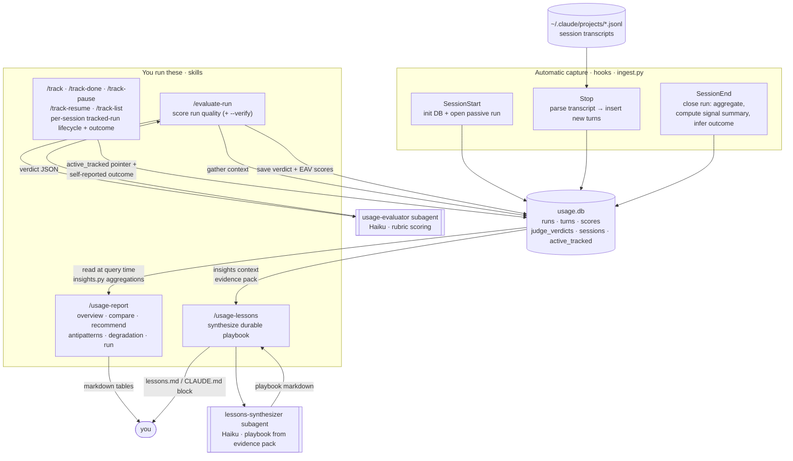

# claude-performance-tracker

A Claude Code plugin that qualifies good agent usage and compares approaches on
cost per successful outcome, where cost means tokens, time and prompts. It
captures and prepares usage information so that you can answer two questions:

1. **Am I using agents well?** And is the model drifting over time?
2. **Which approach is better for this kind of task?** Which model, permission
   mode, subagent strategy or skill gets a task done for the least token, time
   and prompt cost.

The plugin reconstructs everything from the session transcripts Claude Code
already writes to `~/.claude/projects/`. No external services, no daemon, no
runtime dependencies.

---

## Install

```bash
/plugin marketplace add /path/to/agent-toolbox
/plugin install claude-performance-tracker@agent-toolbox
```

Capture starts immediately. Then pick the flow that matches what you want.

> **Warning:** `claude plugin uninstall` deletes `${CLAUDE_PLUGIN_DATA}`, the
> whole directory, including `usage.db` and anything else kept beside it. Months
> of capture go with it. Back the database up outside that directory first:
>
> ```bash
> cp ~/.claude/plugins/data/claude-performance-tracker-*/usage.db ~/usage.db.bak
> ```
>
> Prefer `claude plugin marketplace update` and `claude plugin update` with a
> version bump. An update preserves the data directory.

### See how you're doing

Nothing to set up. Work normally: the plugin records every session as a passive
run. When you want a summary:

```
/usage-report          # pick "overview"
```

### Compare two approaches

Bracket each attempt so the plugin measures its cost on its own:

```
/track                 # name the task, its type, its size and the approach
…do the work…
/track-done            # report the outcome: success, partial or failed, plus a 1-5 score
```

Repeat for the other approach, then compare:

```
/usage-report          # pick "compare" to rank approaches by cost per success
```

### Score the quality of a run

The LLM judge scores recent runs against the rubric:

```
/evaluate-run
```

### Check whether the model is drifting

```
/usage-report          # pick "degradation" for the per-model trend
```

### Turn the history into durable guidance

Once you have a handful of tracked or evaluated runs, distill what works into a
playbook you can re-read and paste into `CLAUDE.md`:

```
/usage-lessons         # writes lessons.md: what works, watch-outs, prompt habits, drift
```

---

## Commands

| Skill | What it does |
|-------|--------------|
| `/track` | Opens a tracked run for this session, taking a label, type, size and intended approach. |
| `/track-done` | Closes it with a self-reported outcome and satisfaction score. |
| `/track-pause` | Detaches this session's tracked run without finalizing it, keeping it resumable. |
| `/track-resume` | Reattaches a paused run to this session, by id or label, even across sessions. |
| `/track-list` | Shows open tracked runs, and whether each is active and where, or paused. |
| `/usage-report` | Renders `overview`, `compare`, `recommend`, `antipatterns`, `degradation` or `run <id>`. |
| `/usage-lessons` | Synthesizes a durable, git-shareable playbook from all runs, through the `lessons-synthesizer` subagent. |
| `/evaluate-run` | Scores runs with the `usage-evaluator` subagent. `--verify` runs a second-opinion pass. |

Every skill runs through the `cpt` launcher on your `PATH`. You can call it
directly:

```bash
SID="$CLAUDE_CODE_SESSION_ID"     # skills pass this so capture is per session
cpt track start  --session-id "$SID" --label "…" --type feature --size M --approach "plan-mode, opus-4-8"
cpt track pause  --session-id "$SID"
cpt track resume --session-id "$SID" --run "<run-id-or-label>"
cpt track done   --session-id "$SID" --outcome success --satisfaction 4   # or --run <id>
cpt track list
cpt report                                     # overview
cpt report compare --by model                  # or --by mode|subagent|skill|effort, --min N
cpt report recommend --type refactor --size L  # actionable "use approach Z"
cpt report antipatterns --since 30d            # recurring friction + rubric candidates
cpt report degradation --period month
cpt report run <run_id>
cpt insights context                           # evidence pack for /usage-lessons
cpt insights lessons-path                      # default lessons.md location
cpt eval list-unjudged
cpt eval reconcile --run-id <run_id>           # disagreement across judge passes
```

---

## Core concepts

**Run**

The unit of analysis: a bounded stretch of work with one cost summary, one
approach and one outcome. `run_id` is session-independent, so a run can own
turns from several sessions.

- **Passive run.** Opened automatically per session, with an inferred outcome.
  Zero effort, always on. It answers where you stand and whether the model is
  drifting.
- **Tracked run.** Bracketed deliberately with `/track` and `/track-done`, with
  a self-reported outcome. This is the instrument for controlled comparisons
  between approach A and approach B.

**Turn**

One user prompt and the assistant work that answered it. This is the atomic
capture unit, and runs aggregate their turns.

**The three scoring layers**

1. **Deterministic metrics**, always on: tokens, time, prompts, tool calls,
   output lines of code, friction signals, context-window pressure.
2. **Self-reported outcome**, mandatory on tracked runs: success, partial or
   failed, plus a 1-5 satisfaction score. This is the ground truth that makes
   cost interpretable.
3. **LLM judge**, opt-in and batched: the `usage-evaluator` subagent scores an
   agent-behavior rubric and per-prompt quality.

**Comparison**

The plugin ranks approaches within buckets of task type and size, on median cost
per successful run, with a small-sample guard so it will not rank an approach on
too few runs. Cheap but failed is never rewarded.

---

## How it works

### Cost is weighted tokens

Summing the four token classes is not a cost. Cache reads bill at 0.1x input,
cache writes at 1.25x for a 5-minute TTL or 2x for an hour, and output at 5x. On
a real session the raw sum is about 95% cache reads. Ranking on it makes a run
that reuses a long cached prefix look far more expensive than one that rebuilds
context from scratch, which is the opposite of the truth.

Every ranking therefore uses weighted tokens, the input-equivalent units in
`scripts/cost.py`. The 5x output multiplier holds for every current model, so
weighted tokens are comparable across models. Converting to dollars needs the
per-model input price, and models absent from the table report `—` rather than a
guess.

Time is reported two ways for the same reason. `active_ms` sums each turn's span
with individual idle gaps capped at 5 minutes, and is what the rankings use.
`wall_clock_ms` is the raw calendar span, which on real data produced 250-hour
runs and is not a cost.

### Where the data comes from

Today the numbers come from parsing session transcripts, and every stored row
records its `source` as `transcript`. A later OpenTelemetry receiver would write
the same tables with `source='otel'`, so adding it only adds rows and requires
no migration.

### Hooks capture the data

| Hook | Role |
|------|------|
| `SessionStart` | Sets up and migrates the database, which is safe to run repeatedly, opens the session's passive run and sweeps runs abandoned by a crash. |
| `Stop` | Does the main work: parses the transcript, inserts new turns and refreshes existing envelopes. |
| `SessionEnd` | Closes the passive run: aggregates turns, computes the signal summary, infers the outcome. |

There is deliberately no `SubagentStop` hook and no `UserPromptSubmit` hook. See
[CHANGELOG.md](CHANGELOG.md) for why each was removed.

Hooks never block the session. On any error they exit 0 and do nothing. Set
`CPT_DEBUG=1` to print the traceback instead, so you can tell a plugin that has
silently stopped capturing from one that is working. They run through the
bundled `bin/cpt` launcher, a bash wrapper that picks a pyenv-independent
interpreter, and they read and write the same SQLite file the skills use, found
through `${CLAUDE_PLUGIN_DATA}`.

#### Python resolution

Hooks and the `cpt` launcher force pyenv's `system` interpreter by setting
`PYENV_VERSION=system`. Without it, a project that pins an uninstalled version
through a pyenv `.python-version` makes a bare `python3`, the pyenv shim, fail
with something like `pyenv: version '3.10.15' is not installed` before this
code runs. The hook's own error handling never gets a chance, and the session
shows a non-blocking hook error. The plugin's scripts use only the standard
library and run on any Python 3.9 or later, so the system interpreter is always
sufficient. If you need a specific one, set `CPT_PYTHON=/path/to/python3`. The
setting is harmless when pyenv is not installed.

### Turn parsing (`transcript.py`)

- A turn starts at a real user prompt: a `type=user` line that is not `isMeta`,
  not a tool result and not one of Claude Code's injected records, such as
  `<task-notification>`, local-command caveats and stdout or
  `[Request interrupted…]`. Those inject no prompt, so they fold into the turn
  already in progress.
- Assistant lines appear more than once in the transcript, since the same
  `message.id` repeats, so the parser counts token usage once per distinct
  `message.id`.
- Each turn is keyed on the user prompt's `uuid`, since the transcript has no
  per-turn id.
- Subagent usage is not in the transcript as sidechain records. `isSidechain` is
  false on every record of every real transcript. It arrives in the `Agent`
  tool's `toolUseResult`, carrying `agentId`, `agentType`, `resolvedModel`,
  `usage` and `totalToolUseCount`, and each subagent becomes its own row keyed
  `agent:<agentId>`. A backgrounded agent's launch result carries no usage; it
  reports back later in a `<task-notification>` with only an aggregate total,
  which the plugin stores separately in `total_tokens_agg` and keeps out of the
  weighted-cost maths rather than guessing at.
- That notification arrives on three different record shapes: `type=user`,
  `type=attachment` and `type=queue-operation`. The parser scans all three.
- A subagent's real envelope comes from its own transcript, at
  `<slug>/<session-id>/subagents/agent-<id>.jsonl`, which carries the full
  per-class split. Those logs also discover the agents, so capture does not
  depend on a notification arriving or on the parser recognizing its shape. The
  plugin ranks the evidence, preferring the agent's own log over a tool result
  over a bare aggregate, and better evidence replaces the earlier figure rather
  than adding to it, since it measures the same spend more precisely.
- `effort` is read from the top level of each assistant record, so
  `--by effort` works.

### Attribution is pinned, the envelope is not

The plugin assigns a turn to a run the first time it sees it, based on whichever
run was active at that `Stop`, and never rewrites its `run_id`, `session_id` or
`query_source`. Switching the tracked or passive pointer mid-session therefore
never relabels earlier turns.

The token envelope, by contrast, refreshes on every pass, taking the larger of
the stored and the freshly parsed value per column. Without that, a turn caught
mid-flight would keep a fraction of its real tokens forever. Because counts only
ever grow, a re-parse of a compacted transcript can never shrink one either. The
whole pass is safe to repeat because `turn_id` is the primary key.

### Tracked runs are per session, with pause and resume

`/track` creates a `tracked` run and records it as the active run for this
session in the `active_tracked` table, keyed by `session_id`, which the skills
read from `$CLAUDE_CODE_SESSION_ID`. The `Stop` hook prefers this session's
active tracked run over its passive run, so turns produced while tracking attach
to the tracked run. Because attribution is per session, two sessions can track
different tasks in parallel without contaminating each other.

A tracked run has three states:

- **active(session)** — a row in `active_tracked`; this session's turns attach
  to it.
- **paused** — open in `runs`, with no `ended_at` or outcome, but absent from
  `active_tracked`. It receives no turns and is resumable.
- **done** — finalized by `/track-done`, and terminal.

`/track-pause` detaches this session's active run and keeps it open.
`/track-resume <id|label>` reattaches a paused run to the current session,
possibly a different session from where it started, so you can pause a task in
one session and finish it in another. `SessionEnd` auto-pauses the session's
active run, detaching rather than finalizing, so the run survives as resumable
instead of being left open in a session that has ended. Only `/track-done`
finalizes a run, defaulting to this session's active run, or taking
`--run <id>` to close a paused one directly. Starting or resuming while already
tracking auto-pauses the previous run, so nothing is lost. `/track-list` shows
all open runs and their state.

Two invariants hold: `active_tracked.session_id` is unique, so a session tracks
at most one run at a time, and `run_id` is unique, so a run is active in at most
one session at a time. Resume cleans up any stale attachment, such as one left
by a crashed session, before reattaching.

### The signal summary (`signals.py`)

When a run closes, `signals.py` derives a signal per turn, then aggregates
across the run's turns. This is scoped per run, so a passive run and a tracked
run that share a session get separate summaries:

| Group | Fields and definition |
|-------|---------------------|
| Approach | `models`, `permission_mode` (distinct, mixed-mode aware), `subagents_used`, `skills_used`, `mcp_tools_used` (servers) |
| Output | `lines_added` and `lines_removed` (from `toolUseResult.structuredPatch`), `files_touched`, `doc_words` (`.md` and doc edits) |
| Friction | `interrupts` (the `[Request interrupted…]` marker, not `toolUseResult.interrupted`, which appears in no real transcript), `re_prompts` (correction-cue prompts), `edits_without_read` (an Edit on an un-read file, since a Write creates context), `reasoning_loops` (a file read three or more times), `premature_stops` (`stop_reason=max_tokens`) |
| Context | `peak_context_tokens` (the raw maximum of input plus cache tokens, the assumption-free figure) and `peak_context_pct` against a window the transcript never states: set `CPT_CONTEXT_WINDOW` to declare it, otherwise 200k, escalating to 1M only if the observed peak exceeds it |

A prompt that never got a reply, usually `/clear`, produces no row in `turns`,
so the plugin carries its bundle forward to the run of the nearest preceding
turn rather than dropping it. Without that, `clear_count` was structurally
pinned at zero.

Lines of code come only from `structuredPatch`. Read results carry a `filePath`
but no patch, so they never count as output. `effort` is left null: it is not in
the transcript and will arrive with the OpenTelemetry upgrade.

### Inferred outcome (`infer_outcome.py`)

Passive runs get a rough outcome from deterministic signals, namely positive and
negative cues in prompts, interrupts, re-prompts and whether any output was
produced, through a documented six-step decision. The plugin stores it with
`outcome_source='inferred'` and saves the signals as JSON in `inferred_signals`
so you can audit the result. When the signals are not clear enough, the outcome
is `unknown`. The comparison ranking never mixes inferred outcomes with
self-reported ones: the compare view uses `self_report` only.

### Qualitative scoring (`evaluate.py` and `usage-evaluator`)

`/evaluate-run` picks its targets, either a run id or recent runs not yet
judged, gathers the context of transcripts, per-turn prompts and the rubric, and then
hands it to the `usage-evaluator` subagent, which runs on Haiku at low effort
and returns a structured verdict. The plugin then saves one `judge_verdicts` row
plus detailed `scores` rows.

Scores use an EAV layout, with `subject_type` of `run` or `prompt`, plus
`dimension`, `score`, `rationale` and `rubric_version`, so adding a dimension to
`rubric.yaml` needs no schema change. The plugin reads the rubric version
without a YAML library.

Each rubric dimension carries concrete 0/1/2 calibration anchors so scores stay
comparable across runs and resist reward-hacking. Length, tool count and
confident phrasing are never evidence. `/evaluate-run --verify` runs a second
judge pass, and `cpt eval reconcile` flags any dimension where the passes differ
by more than a point, surfacing it on the run scorecard. Single-pass stays the
default, and verification is opt-in.

### Reporting (`report.py`)

The plugin computes all numbers at read time from the raw `runs`, `turns` and
`scores` tables. Nothing is pre-aggregated, so any new report or exporter is
just another query.

- `overview` — totals, plus by-model, by-project, by-day and by-query-source
  when subagents ran.
- `compare` — cost-per-success ranking bucketed by task type and size, with a
  small-sample guard.
- `recommend` — the actionable form of `compare`: the cheapest-per-success
  approach for a given task type and size, or the best per bucket. The plugin
  surfaces this automatically at `/track` time.
- `antipatterns` — recurring friction across runs, worst first, with the share
  landing in a bad outcome and where each clusters. Friction signals with no
  matching rubric dimension are flagged as candidates to add, turning incidents
  into evaluation criteria. It also reports the weakest prompt habits.
- `degradation` — the efficiency and friction trend per model and period, plus
  the average judge score.
- `run <id>` — the full scorecard for one run, including the judge verdict and
  per-prompt quality joined through `scores`, and a judge-agreement note when a
  run has more than one verdict.

`insights.py` derives `recommend`, `antipatterns` and the `/usage-lessons`
evidence pack. It is a read-time aggregation layer over the same raw tables, so
it adds no storage and stays source-agnostic like every other report.

### Data flow

Two halves feed one database. The hooks capture data automatically as you work,
and the skills are commands you run to add outcomes and read reports.


```mermaid
flowchart TD
    T[(~/.claude/projects/*.jsonl<br/>session transcripts)]

    subgraph Hooks [Automatic capture · hooks · ingest.py]
      direction TB
      SS[SessionStart<br/>init DB + open passive run]
      ST[Stop<br/>parse transcript → insert new turns]
      SE[SessionEnd<br/>close run: aggregate,<br/>compute signal summary, infer outcome]
    end

    subgraph Skills [You run these · skills]
      direction TB
      TR["/track · /track-done · /track-pause<br/>/track-resume · /track-list<br/>per-session tracked-run lifecycle + outcome"]
      EV["/evaluate-run<br/>score run quality (+ --verify)"]
      RP["/usage-report<br/>overview · compare · recommend<br/>antipatterns · degradation · run"]
      LE["/usage-lessons<br/>synthesize durable playbook"]
    end

    UE[[usage-evaluator subagent<br/>Haiku · rubric scoring]]
    LS[[lessons-synthesizer subagent<br/>Haiku · playbook from evidence pack]]
    DB[("usage.db<br/>runs · turns · scores<br/>judge_verdicts · sessions · active_tracked")]

    T --> ST
    SS --> DB
    ST --> DB
    SE --> DB

    TR -->|active_tracked pointer +<br/>self-reported outcome| DB
    EV -->|gather context| DB
    EV --> UE
    UE -->|verdict JSON| EV
    EV -->|save verdict + EAV scores| DB
    DB -->|read at query time<br/>insights.py aggregations| RP
    RP -->|markdown tables| User([you])
    DB -->|insights context<br/>evidence pack| LE
    LE --> LS
    LS -->|playbook markdown| LE
    LE -->|lessons.md / CLAUDE.md block| User
```

---

## The data model

One SQLite database at `${CLAUDE_PLUGIN_DATA}/usage.db`, which is
`~/.claude/plugins/data/claude-performance-tracker/usage.db`:

| Table | Purpose |
|-------|---------|
| `runs` | One row per run, the scorecard: tags, approach, signal summary, output, friction, context, outcome. |
| `turns` | One row per turn, carrying both `session_id` and `run_id`, so a run can span sessions, plus `query_source` of `main` or `subagent`. |
| `scores` | Long-form EAV qualitative scores for runs and prompts, stamped with `rubric_version`. |
| `judge_verdicts` | One row per judge pass, the provenance for the scores. |
| `sessions` | Maps `session_id` to `run_id`, plus the transcript path, which keeps `run_id` session-independent. |
| `active_tracked` | Per-session pointer from `session_id` to the tracked run that session is capturing into. Absence means paused. |

Raw facts only. `report.py` computes the derived and comparison metrics.

---

## Development

The plugin has zero runtime dependencies. It uses only the Python standard
library, and even parses the rubric without `pyyaml`, so everything runs with
just `python3`.

### Run the tests

```bash
cd plugins/claude-performance-tracker
python3 -m unittest discover -s tests
```

### Iterate without reinstalling

This is the fastest loop. Claude Code loads the plugin straight from the working
tree for one session and picks up your edits on each launch:

```bash
claude --plugin-dir /path/to/agent-toolbox/plugins/claude-performance-tracker
```

### Refresh the installed copy

The marketplace caches a snapshot at the plugin's `version`, so
`claude plugin update` does nothing while the version is unchanged. Bump
`version` in both `plugin.json` and the marketplace entry, then run
`claude plugin marketplace update` followed by `claude plugin update`. Prefer
this over uninstalling and reinstalling, which deletes your data directory.

`cpt` lands on `PATH` only in a new session after install. The skills include a
cache-glob fallback for when it is not yet found.

### Repair an existing store

```bash
cpt backfill    # re-derive every session's turns from its transcript
cpt sweep       # finalize runs abandoned by a crash (also runs at SessionStart)
```

`backfill` corrects a database written by an older version in place: it refills
truncated envelopes, drops rows the parser no longer produces, relabels
mislabeled subagent rows and recomputes every affected run's aggregates,
signals and inferred outcome. It only rewrites sessions whose transcript still
exists; for the rest it applies what it can establish from the stored row alone.
Both commands are safe to re-run. Run `backfill` after upgrading, and see
[CHANGELOG.md](CHANGELOG.md) for which versions changed the parser.

### Layout

```
claude-performance-tracker/
├── .claude-plugin/plugin.json
├── hooks/hooks.json                 # SessionStart · Stop · SessionEnd
├── bin/cpt                          # launcher: ingest | track | report | eval | insights | backfill | sweep
├── agents/usage-evaluator.md        # Haiku judge (agent behavior + prompt quality)
├── agents/lessons-synthesizer.md    # Haiku playbook synthesizer (for /usage-lessons)
├── skills/{track,track-done,track-pause,track-resume,track-list,usage-report,usage-lessons,evaluate-run}/SKILL.md
├── scripts/
│   ├── db.py            # data-dir resolution + idempotent schema init
│   ├── schema.sql       # runs · turns · scores · judge_verdicts · sessions · active_tracked
│   ├── ingest.py        # hook dispatch (never blocks the session)
│   ├── cost.py          # weighted (input-equivalent) tokens + USD estimate
│   ├── transcript.py    # turn parsing (dedup, boundaries, subagent rows)
│   ├── store.py         # run/turn persistence, tracked-run lifecycle, finalize
│   ├── track.py         # start · pause · resume · done · list (the skills call this)
│   ├── signals.py       # deterministic signal summary derivation
│   ├── infer_outcome.py # passive-run outcome heuristic
│   ├── evaluate.py      # list-unjudged · context · persist · reconcile
│   ├── insights.py      # read-time aggregations (bucket winners, friction, lessons pack)
│   ├── rubric.py        # rubric version/keys (no YAML dep)
│   ├── rubric.yaml      # the editable rubric (versioned, with calibration anchors)
│   ├── maintenance.py   # backfill (repair from transcripts) · sweep (abandoned runs)
│   └── report.py        # overview · compare · recommend · antipatterns · degradation · run
└── tests/               # one test module per slice, stdlib unittest
```

### Extend it

- **Add a rubric dimension.** Add an entry under `agent_behavior` or
  `prompt_quality` in `rubric.yaml` and bump `version`. No schema change is
  needed, since scores are EAV, and old scores keep their stamped version so
  reports never compare across rubric versions silently.
- **Add a deterministic metric.** Derive it in `signals.py`, and add a column to
  `runs` if it is run-level. Reports read raw rows, so surfacing it is a query
  change only.
- **Add OpenTelemetry as a data source.** Add an OTLP-to-SQLite writer that
  inserts rows with `source='otel'`. The schema and the reports are already
  source-agnostic.

---

## Design notes and decisions

**Why a plugin rather than the alternatives**

The capability is inherently multi-component. It needs hooks to capture, skills
to track, report and evaluate, a subagent to judge, plus shared scripts and
shared storage. The plugin is what lets those parts behave as one thing.

Compared with wiring up raw skills, hooks and a subagent separately:

- They must be versioned and installed together. A hook that calls a script
  owned by a separate skill folder is fragile and breaks the moment one half
  moves. The plugin gives hooks a stable `${CLAUDE_PLUGIN_ROOT}` to find scripts.
- Shared state needs a shared home. Every component reads and writes one SQLite
  file, and the plugin's `${CLAUDE_PLUGIN_DATA}` is a persistent directory that
  survives updates. Loose components have no agreed, stable data path.
- One install, one uninstall, one version. Merging hook config into
  `settings.json` by hand, copying a subagent and symlinking skills is
  error-prone and leaves orphans behind. `claude plugin install` and
  `uninstall` are atomic.
- Auto-namespacing as `/claude-performance-tracker:track` avoids collisions with
  your other skills.
- A marketplace can distribute it, each plugin installs individually, and future
  pieces install alongside it.

Compared with OpenTelemetry plus Prometheus or Grafana: that stack is good for
metrics, but it requires a running collector or daemon, and it has no notion of
task identity, outcome or a rubric for good usage, which are the things that
make this useful. OpenTelemetry is on the roadmap as a more precise data source,
not as a replacement for the annotation and evaluation layer.

Compared with a standalone script or cron job parsing JSONL: it can do
accounting, but it cannot hook the lifecycle. No `/track` demarcation, no live
subagent attribution, no in-session skills. You would rebuild most of what the
plugin already does with none of the integration.

Compared with a hosted service: your transcripts never leave the machine. No
latency, no per-call cost, no account. For a personal tool that answers how you
use agents, local-first is the right default.

**Marketplace source form.** Use an explicit `source: "./plugins/<name>"` in
`marketplace.json`. Some Claude Code versions reject the `metadata.pluginRoot`
shorthand with "source type your Claude Code version does not support".

**`${CLAUDE_PLUGIN_ROOT}` is a versioned cache directory**, at
`…/cache/<marketplace>/<plugin>/<version>/`. The bundled `scripts/` and `bin/`
ship there.

**`CLAUDE_PLUGIN_*` is not in the session shell**, so skills cannot reference
those variables in the commands they run. Hence the `bin/cpt` launcher, since
Claude Code does add a plugin's `bin/` to `PATH`. The data directory Claude Code
hands the hooks is also suffixed with the install source, either
`claude-performance-tracker-<marketplace>` or `-inline` under `--plugin-dir`, so
the read side cannot guess the unsuffixed name. The hooks write with
`$CLAUDE_PLUGIN_DATA`, and the CLI and skills, which have no environment
variable, discover the populated sibling directory instead through
`db._discover_populated_dir`, where most turns wins.

**Cost is tokens, not dollars.** On a subscription there is no per-token bill,
so token counts are the consistent, comparable cost signal.

**Comparison is bucketed and guarded.** Averaging across task difficulty would
measure which approach you used on harder tasks. Bucketing plus a small-sample
guard keeps it honest.

---

## Roadmap

Foundations are laid for each, and none requires a rewrite.

- **OpenTelemetry receiver**, for precise `cost_usd`, `duration_ms` and
  attribution without re-deriving them.
- **Scheduled digest** that runs `/usage-lessons` automatically.
- **Live statusline** and **real-time prompt coaching**.
- **Persisted anti-pattern promotion state**.
- **Richer exporters**: JSON, CSV, HTML and a dashboard over the same raw
  tables.

## Changelog

See [CHANGELOG.md](CHANGELOG.md).
